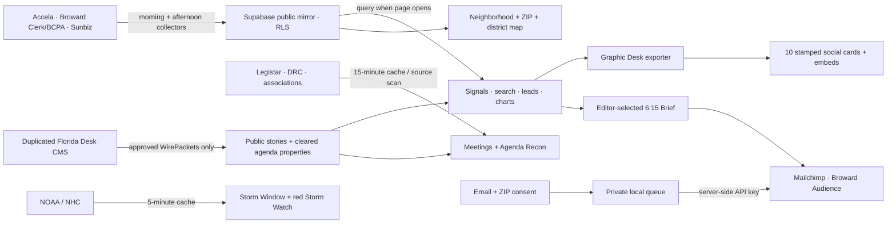

# Florida Signal build + operating handoff

Updated July 17, 2026. This is the source-of-truth handoff for the Florida Signal build in this folder. It distinguishes what is genuinely connected now, what reads on demand, what must be refreshed by an upstream job, and what is connection-ready but not yet running.

## Outcome

Florida Signal is now a bright, branded development-intelligence product for Broward’s local field operators and its out-of-state “frequent fliers”: developers, brokers, real estate agents, contractors, owners and anyone who needs the scoop before walking the block or booking the flight.

The default background should remain white. It makes the emblem, photography, teal, yellow, orange and live-data graphics feel sharper and more trustworthy. Pale blue and mint work best as data-zone changes; navy is most effective as an intentional intelligence/storm surface. A full light-blue page would flatten the hierarchy.

Delivered in this build:

- a swipeable, auto-advancing mobile Live Now desk showing the newest cited filing, permit universe, Broward record and next watched room before the static hero copy;
- a **Mobile Field Test** that accepts browser location or a typed address, neighborhood, ZIP or permit, plots the current mapped sample, and ranks the nearest visible filings without storing the visitor’s coordinates;
- six-face homepage data flipper, including Diagram of the Day and watched public meetings;
- ten distinct live Graphic Desk cards with branded center emblems, exact spans, social images, share pages and embed mode;
- official neighborhood, ZIP, heat, U.S. House, Florida Senate, Florida House and Broward-corridor map layers;
- a controlled site/CMS taxonomy with tag-driven neighborhood templates and clean editorial tag lines;
- the sponsorable **Signal Spyglass** system: connected mini-map Spotlights for What Moved, Storm Readiness and Rooms Watched;
- search and Lead Desk cards with neighborhood signatures, exact-map actions, Street View, satellite, text and native share;
- public + industry meeting watch and a source-gated Agenda Recon map;
- three-phase storm intelligence and a persistent red Storm Watch display mode with hurricane icon;
- historical Hurricane Irma archive treatment, never presented as current conditions;
- editorial-only Brightline corridor feature with date and licensing treatment;
- approved-only Florida Desk CMS adapter modeled on the Michigan Intel Desk separation of collection, review and publication;
- consented email + watched-ZIP capture and a server-side Mailchimp adapter for the existing **Broward Audience**; and
- dim sponsor inventory that cannot affect records, leads, rankings or editorial conclusions.

## How the system is meant to run



## What updates live, twice daily, and editorially

| Surface/data | Reader refresh behavior | Required upstream cadence | Date used for analysis | Current state |
|---|---|---|---|---|
| Fort Lauderdale permits | Supabase query on page open/search | **Morning + afternoon** Accela delta | `applied_date`; issued date only when explicitly labeled | Live browser read |
| 14-day filing pulse | Paginated live query; fixed calendar window retains zero days | Same **1–2× daily** Accela delta | `applied_date` only | Live browser read |
| Mapped permit sample | Newest geocoded records returned and resolved into official boundaries | Same **1–2× daily** permit + geocode refresh | Actual `applied_date` span in returned sample | Live browser read, capped sample |
| Mobile Field Test | On-demand browser-only location or typed-place scan of the current mapped sample | Same **1–2× daily** permit + geocode refresh | Each filing’s `applied_date`; distance is calculated at scan time | Live; location is not stored; coverage is the displayed sample, not every permit |
| Broward deeds, mortgages, liens, NOCs | Reads the newest successful enriched cache | **Morning + afternoon** Clerk pull/enrichment | `recording_date_iso` | Connected cache; timestamp visible |
| Sunbiz entities | Reads the newest successful entity cache | **Morning + afternoon**, or after new filings arrive | State application/registration date | Connected cache; timestamp visible |
| Parcel/owner context | Reads existing BCPA/parcel cache | **Daily** delta; weekly quality audit | Property source effective/sale dates | Connected where resolved |
| Meetings/hearings | Same-origin feed, 15-minute cache | Calendar scan at least **morning + afternoon**; faster when agendas post | Scheduled Eastern start | Connected source reader |
| Agenda PDFs/property recon | Only source-cited, geocoded, editor-cleared rows publish | On agenda publication; check several times on meeting days | Meeting date + cited packet page | Gate installed; collector/agent not running |
| Atlantic storm state | Same-origin NHC JSON, 5-minute cache; official outlook image stays live | Continuous during hurricane season | NHC publication/update time | Connected official source |
| Storm-relevant local filings | Same current mapped permit sample | Same **1–2× daily** permit delta | Permit `applied_date` | Live browser read |
| Graphic Desk cards | Re-render from the live site | **After each successful source refresh**, minimum daily | The event span printed on each card | Exporter installed; 10 cards generated |
| Email + ZIP signup | Immediate private write | Immediate Mailchimp upsert when key is present; retry pending rows | Consent timestamp | Local capture live; Mailchimp key not set |
| Daily Intel Brief | Human-curated from sourced candidates | Editor review before 6:15 a.m. | Each underlying record’s event date | Editorial workflow; send automation not running |

An operating target is not evidence that a collector ran. The site must keep showing the newest source/cache timestamp. If a collector misses a run, the honest behavior is an older timestamp or an unavailable state—not invented freshness.

## Methodology and date-span contract

Florida Signal keeps two clocks separate:

1. **Market/event clock** — when a permit was applied for, an instrument was recorded, a company registration occurred, or a meeting begins.
2. **System clock** — when the platform pulled, first saw, enriched, cached or published the item.

Charts, rankings, neighborhood comparisons and “what moved” use the market/event clock. A batch arriving today does not make its contents today’s activity. Pull and enrichment times are freshness metadata only.

Every visual uses one of four explicit labels:

| Label | Meaning |
|---|---|
| **Window** | First and last event date included. |
| **Sample** | Returned record cap plus the actual event-date span inside it. |
| **Snapshot** | Last successful pull or enrichment time for a cached source. |
| **Cumulative** | Total through a named date, not a single-day total. |

The live cards currently demonstrate the standard directly: the application pulse is a fixed 14-calendar-day series (including zero days); Place Lens identifies the newest 700 mapped applications and their exact applied-date span; the high-value queue discloses its 40-record cap and actual span; Broward and cache-backed graphics say “snapshot” or “through” rather than implying all records happened today.

### Geography standard

- A point needs defensible coordinates; otherwise it does not appear on the map.
- Neighborhood names come from official City polygons and follow one visual naming convention across cards, popups, search and social views.
- ZIP areas and legislative districts use official Census geography.
- Counts describe the displayed sample, never total historical market share.
- The corridor layer is context. Hollywood, Pompano Beach, Oakland Park, Wilton Manors, Plantation, Cooper City and Southwest Ranches need their own municipal collectors before Florida Signal calls their activity live.
- Tax liens do not receive a neighborhood label until instrument-to-folio/address resolution is defensible.
- Signal Spyglass mini maps reuse the same coordinates, permit IDs, taxonomy and dates as the canonical field map. Meeting-room points are explicitly room addresses—not project sites—and source-cleared agenda properties remain on the Agenda Recon map.
- Mobile Field Test “nearby” results are straight-line distances from the browser location to geocoded records in the current capped sample. A typed neighborhood/address/ZIP scan matches the canonical record, geography and taxonomy fields; it is not a claim of complete municipal coverage.

### Editorial standard

- No source, no claim.
- A raw record may appear as a sourced record; narrative interpretation requires human review.
- “Lead” means a public-record signal worth qualifying, not a claim that an owner is soliciting work.
- Industry association events are visibly distinct from government hearings.
- Agenda Recon needs an official packet, cited item/page, property identifier, coordinates and `editor_status: "cleared"`.
- Storm Watch is a display/operations lens, not an official warning service.
- Hurricane Irma photography is explicitly historical and cannot be used to imply current conditions.
- The Brightline image is Editorial Use Only and cannot be used as sponsor creative, advertising or an endorsement.
- Sponsors cannot influence records, rankings, lead qualification, story selection, findings or corrections.

## CMS and agenda recon contract

The site is ready to point at a **duplicated Florida Desk service**; it never alters the Michigan original. Configure `FLORIDA_SIGNAL_CMS_URL` and, if needed, `FLORIDA_SIGNAL_CMS_TOKEN`.

The public adapter tries these endpoints in order:

1. `/api/wire/packets` — only approved, published or cleared packets with a public source link;
2. `/api/tracker-feed.json` — only tracker-eligible sourced output as a compatibility fallback;
3. `/api/agenda-recon` — only `editor_status: "cleared"` properties with public source URL and coordinates.

It deliberately never queries an internal `/api/stories` or draft queue. Collection, analysis, review, approval and publication stay separate.

Every approved story can carry topic, geography, entity, source, audience and urgency tags. The adapter returns them as both a flat prefixed `tags` array and grouped `taxonomy` object. The complete naming convention and CMS JSON example live in `FLORIDA_SIGNAL_TAGGING_SYSTEM.md`. The browser keeps all tags in `data-signal-tags`, but shows only a restrained editorial “Filed under” line—no pill-box tag cloud.

Recommended Agenda Recon object:

```json
{
  "meeting_title": "Development Review Committee",
  "meeting_date": "2026-07-28",
  "item_number": "official item number",
  "property_address": "officially extracted address",
  "folio": "officially extracted folio if present",
  "applicant": "officially extracted party",
  "proposed_action": "plain-language action grounded in the packet",
  "source_url": "https://official-agenda-packet.pdf",
  "source_page": 42,
  "lat": 26.0,
  "lon": -80.0,
  "source_hash": "packet hash",
  "confidence": 0.98,
  "editor_status": "cleared"
}
```

## Mailchimp state

- Existing real audience renamed to **Broward Audience**.
- Audience ID: `123540d751`.
- Server prefix: `us2`.
- Watched-ZIP merge field: `WATCHZIP` (“ZIP You Watch”).
- Existing subscribers were not edited and no campaign was sent.
- `server.py` performs a server-side member upsert only after a valid consented email + ZIP submission.
- The API key is intentionally absent. Creating a persistent account credential requires an explicit confirmation at the moment of creation. Until it is added as `MAILCHIMP_API_KEY`, signups remain safely stored in the private local queue with a pending sync state.

## Branded graphics, sharing and photography

`social/export_graphic_desk.cjs` opens each live Graphic Desk card and exports a 1200-pixel social image. It also writes ten share landing pages with Open Graph and X/Twitter metadata. Set `FLORIDA_SIGNAL_PUBLIC_URL` when the production hostname differs from `https://thefloridasignal.com`.

The current ten cards are:

1. Permit Application Pulse
2. Place Lens: Neighborhood + ZIP
3. Trades Pulse
4. High-Value Filing Queue
5. Property Value Universe
6. Operator Board
7. Broward Records Desk
8. Company Lens
9. Storm Window
10. Meetings Watch

Legacy static generators and old embed files were moved into `_source_copies/` and are not part of the publish set; this prevents stale sample numbers from being mistaken for live output.

Licensed photo provenance, captions, alt text, visible placement and restrictions are documented in `assets/photos/README.md`. All eight Adobe Stock files supplied on the Desktop are accounted for, web-optimized and used visibly: six in the homepage field-photo strip, the Hurricane Irma archive image in Storm Window and the Editorial Use Only Brightline station image in the neighborhood corridor feature.

## Visual QA completed

The final design pass checked all seven public pages at 390-pixel mobile and 1600-pixel desktop widths: Home, Neighborhoods, Broward Record, Graphic Desk, Storm Window, Meetings and Method. The audit found no broken images, page-level horizontal overflow or type below 7 pixels after the fixes. It also verified the enlarged header lockup, fully uncovered hero photo, mobile Live Now desk, icon-led single-row record/share toolbars, non-overlapping Graphic Desk brand/date/actions, and separated Agenda Recon watermark/status. All ten social PNGs were regenerated from the corrected cards.

## Code map

| File/path | Responsibility |
|---|---|
| `index.html` | Homepage, brief capture, six-face flipper, signals, diagrams, maps, storm/sponsor surfaces |
| `neighborhoods.html` | Search, Lead Desk, hyperlocal map, ZIP/district/corridor layers, Brightline editorial feature |
| `graphics.html` | Ten live shareable/embeddable intelligence graphics |
| `meetings.html` | Government + industry watch, source actions and Agenda Recon |
| `broward.html` | Broward recorded-instrument and ownership/company context |
| `storm.html` | NHC state, before/during/after data windows and Hurricane Irma archive |
| `method.html` | Public cadence, span definitions, sources and editorial/sponsor firewall |
| `app.js` | Supabase queries, date pagination, rendering, sharing, maps/layers, search, leads, CMS display and storm mode |
| `server.py` | Same-origin feeds, approved CMS adapter, agenda gate, local subscriber DB and Mailchimp upsert |
| `data/agenda_recon.json` | Agent/editor handoff; public route filters it again |
| `social/export_graphic_desk.cjs` | Deterministic live-card exporter |
| `social/graphic-desk/` | Ten generated social PNGs |
| `share/` | Ten canonical Open Graph share pages |
| `assets/photos/README.md` | Licensed-photo provenance and usage rules |
| `FLORIDA_SIGNAL_TAGGING_SYSTEM.md` | Controlled taxonomy, neighborhood template rules and CMS story contract |

Key browser functions: `loadPublicRecord`, `fetchApplicationDates`, `renderInfographics`, `runRecordSearch`, `renderLeadDesk`, `loadMeetings`, `loadAgendaRecon`, `loadCmsContent`, `toggleMapOverlay` and `initStormMode`.

Key server functions: `meeting_payload`, `nhc_payload`, `cms_payload`, `agenda_recon_payload`, `mailchimp_upsert` and the `/api/subscribe` handler.

## Production runbook

1. **Previous evening:** collect Accela, Broward Clerk/BCPA and Sunbiz; preserve source timestamps and failures.
2. **Before 5:30 a.m.:** collect the morning delta, resolve addresses/entities/parcels, geocode, and nominate deterministic signals.
3. **Before 6:00 a.m.:** scan newly posted agendas and let the editor review sourced Brief candidates.
4. **After successful data completion:** export the Graphic Desk so social cards carry the new dates and numbers.
5. **6:15 a.m.:** send the editor-approved Mailchimp Brief, optionally segmented by watched ZIP.
6. **Midday/afternoon:** run the second permit/record/company delta and regenerate affected site/social surfaces.
7. **Meetings:** scan at least morning and afternoon; increase frequency on meeting days and expected agenda-publication windows.
8. **Storm season:** leave NHC status automatic; an editor controls escalated Storm Watch wording and operations beyond the official-source display.
9. **Weekly:** audit boundaries, unresolved addresses, corrections, duplicate entities, failed joins and source schema changes.

## Remaining production work — do not present as finished

1. **Connect Mailchimp:** create a scoped API key after explicit confirmation and set `MAILCHIMP_API_KEY`; then replay locally pending consented signups.
2. **Deploy the duplicated Florida Desk CMS:** copy the Michigan service, change Florida sources/vocabulary/branding, and set the CMS URL/token. The approved-only web adapter is complete.
3. **Run agenda agents:** schedule official packet discovery, download, hashing, extraction, address/folio resolution and editorial-review queues. The public gate and map are complete.
4. **Launch upstream 1–2× daily collectors:** this site reads the existing Supabase data but does not itself schedule Accela, Broward or Sunbiz collection.
5. **Resolve tax-liens geographically:** build a defensible instrument → party/address → parcel/folio pipeline before neighborhood heat maps.
6. **Add municipal connectors:** Hollywood, Pompano Beach, Oakland Park, Wilton Manors, Plantation, Cooper City and Southwest Ranches currently have geography/context, not full live permit universes.
7. **Build the HOA/condo layer:** current search can surface association language already present in records; a complete association roster, board calendar and property-resolution layer does not yet exist.
8. **Automate social publication:** images and share URLs are ready; posting to LinkedIn/Facebook/X remains editorial/manual until account authorization exists.
9. **Finish sponsorship operations:** visual inventory exists; sponsor intake, asset approval, billing and rotation scheduling do not.
10. **Production infrastructure:** choose the public host, configure HTTPS/domain, private persistent database/backups, secrets, RLS audit, monitoring and collector alerts.

## Source doors

- [Fort Lauderdale Legistar calendar](https://fortlauderdale.legistar.com/Calendar.aspx)
- [Fort Lauderdale Development Review Committee](https://www.fortlauderdale.gov/Government/Departments/Development-Services/Urban-Design-and-Planning/Development-Applications-Boards-and-Committees/Development-Review-Committee)
- [Fort Lauderdale FLTV](https://www.fortlauderdale.gov/government/departments-i-z/strategic-communications/fltv)
- [RWorld official calendar](https://calendar.rworld.com/)
- [Construction Association of South Florida events](https://www.casf.org/events/)
- [National Hurricane Center](https://www.nhc.noaa.gov/)
- [U.S. Census TIGERweb](https://tigerweb.geo.census.gov/tigerwebmain/TIGERweb_apps.html)
