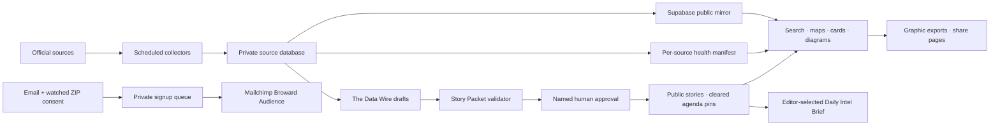

# Florida Signal build and operating handoff

Updated July 17, 2026. This is a historical launch report. For current production truth, including the August site incident and automation state, read [`SYSTEM_STATE_2026-08-11.md`](SYSTEM_STATE_2026-08-11.md). It separates verified event data from system freshness, and finished interfaces from production infrastructure that still needs to be deployed.

## Product outcome

Florida Signal is now a bright, branded development-intelligence product for Broward field operators and frequent fliers: developers, brokers, real estate agents, contractors and owners who want block-level context before walking the site or booking the flight.

White should remain the default background. It gives the navy typography, Florida emblem, photography, teal, yellow and orange the cleanest hierarchy. Pale blue and mint work as data-zone changes; navy is reserved for high-energy intelligence surfaces; red is reserved for publisher-activated Storm Watch.

Delivered:

- an enlarged, legible desktop and mobile identity system with the Florida emblem used as a watermark, map signature and graphic center;
- a dynamic mobile Live Now rail ahead of the static hero, followed by a Mobile Field Test for browser location or typed address/neighborhood/ZIP/permit lookup;
- a six-face public-record flipper that absorbs the old four-stat block and includes Diagram of the Day and watched meetings;
- neighborhood, ZIP, heat, congressional, state legislative and corridor layers using one naming convention;
- interactive permit/lead cards with exact-map action, Street View, satellite, text, native share and copied branded links;
- the Signal Spyglass mini-map/Spotlight system for filings, readiness and watched rooms;
- a meetings desk with government and industry sources, agenda links, video actions and source-gated Agenda Recon;
- a three-phase Storm Window and a publisher-controlled red Storm Watch mode with storm icon, official track/outlook, satellite, coordinates and a red information ticker;
- an investigation-first Data Room with its live map and heat-density view first, followed by organized Now, Places, Property and Watch rooms;
- ten visually distinct Data Room diagrams with centered full-color Florida Signal crests, explicit data spans, direct source destinations, share pages, embeds and 1200-pixel social exports;
- consistent larger map branding, a right-side social rail and a separate document-plus Field Brief control so the report builder cannot be mistaken for the Florida emblem;
- a city-scoped briefs home and **The Data Wire**, a private source-gated CMS derived from the useful Michigan desk patterns without altering the Michigan repositories;
- a restrained site/CMS taxonomy that tags stories, neighborhoods, entities, sources, audiences and urgency without a wall of AI-looking pills;
- a ten-second, dismissible daily-brief signup for email plus watched ZIP;
- site-wide sponsor inventory that is visibly subordinate to the record and cannot influence rankings or editorial conclusions;
- local privacy-minimized analytics events, search/AI discovery files, schema metadata, favicons, accessibility improvements, brand kit, four social masters and a Mailchimp-safe newsletter template; and
- all eight supplied Adobe Stock photos labeled, optimized, documented and placed according to their licenses.

## Architecture



AI may extract, compare, summarize and nominate. It cannot approve or publish. A public story or agenda pin requires cited source material and a named human decision.

## What is live, scheduled or editorial

The current production cadence was verified from the existing Florida pipeline documentation and timer configuration. A target cadence is not proof that a job ran; the public health strip must always show the latest observed event and system clocks.

| Source or surface | Current reader behavior | Actual upstream cadence | Analysis date | State on July 17 |
|---|---|---|---|---|
| Fort Lauderdale permit mirror | Browser queries public Supabase on page open/search | Supabase mirror every 30 minutes | `applied_date` | Current; applications through Jul 16 |
| New permit intake | Feeds the mirror after collection | Daily at 10:00 PM | `applied_date` | Active upstream |
| Accela detail lane | Enriches record detail | Every 30 minutes | Source event dates | Active upstream |
| Permit/entity enrichment | Resolves operators and joins | Every 2 hours | Underlying event date | Active upstream |
| 14-day application pulse | Paginated public query with zero days retained | Follows permit intake/mirror | `applied_date` only | Current record rows |
| Map and Mobile Field Test | Searches the current capped, geocoded sample | Follows permit/geocode refresh | Each permit's `applied_date` | Connected; sample limits disclosed |
| Aggregate dashboard | Reads `dashboard_cache` | Refresh after a successful aggregate build | Underlying event span | Stale; cache still Jul 11 |
| Broward deeds, mortgages, liens and NOCs | Reads latest enriched cache | Daily at 9:30 AM | `recording_date_iso` | Stale public snapshot; through Jul 7 |
| Sunbiz raw ingest | Used in exact/entity enrichment | Nightly at 11:30 PM | State application/registration date | Pipeline documented; public health timestamp not exposed, so the site says unverified |
| Parcel/owner context | Reads existing parcel joins | Existing pipeline/cache | Property effective/sale date | Connected where resolved |
| Fort Lauderdale Legistar | Same-origin request with cache | Every 15 minutes | Scheduled Eastern start | Current runtime check |
| DRC and industry rooms | Source-linked editorial listings | Recheck when source publishes/changes | Scheduled Eastern start | Source-cited snapshot, not a live crawler |
| Agenda PDF/property recon | Draft extraction only; only cited, geocoded and human-cleared rows publish | On agenda publication; increase on meeting days | Meeting date plus cited packet page | CMS gate complete; collector agents not scheduled |
| NHC storm state | Same-origin official-source request | Five-minute cache | NHC publication/update time | Connected |
| Storm Watch mode | Audience sees publisher state | Manual editorial control | Mode publication time | Complete; off by default |
| Data Room | Live map renders the current mapped sample; diagrams render current site values | Re-export affected diagrams after successful source refresh | Printed event span | Map/heat investigation first; ten social images generated |
| Signup | Immediate private local write | Immediate Mailchimp upsert when key exists | Consent time | Local capture works; Mailchimp key absent |
| Daily Intel Brief | Human-curated downstream view | Daily editor review before send | Each record's event date | Template ready; send automation not running |
| Analytics | Same-origin event endpoint | Immediate | Event occurrence time | Local SQLite only; production store not deployed |

The public `/api/data-health` endpoint reports each source independently as `current`, `delayed`, `stale`, `unverified` or `unavailable`. It never applies one global “updated” time to unrelated datasets.

## Date and methodology contract

Florida Signal maintains two clocks:

1. **Event clock** — application, registration, recording, sale or meeting date.
2. **System clock** — pull, first-seen, sync, enrichment, cache or publication time.

Charts, rankings, neighborhood comparisons and “what moved” use the event clock. A batch pulled today does not turn older records into today’s activity. System times are freshness metadata only.

Every visual uses an explicit date treatment:

| Label | Meaning |
|---|---|
| **Window** | First and last event date included |
| **Sample** | Returned cap and actual event-date span inside it |
| **Snapshot** | Last successful source pull/enrichment time |
| **Cumulative** | Total through a named date, not a single-day count |

Geography rules:

- No defensible coordinates means no point on a map.
- Neighborhood names come from official City polygons and use the same naming convention across cards, popups, stories, graphics and CMS records.
- ZIP and legislative layers use official geography.
- Counts describe the displayed sample unless explicitly labeled cumulative.
- Corridor names are context, not proof of a complete municipal permit universe.
- Tax liens do not receive a hyperlocal label until instrument-to-folio/address resolution is defensible.
- Meeting-room points are room addresses, not development sites. Agenda properties become separate pins only after official packet citation and human clearance.
- Mobile “nearby” distance is calculated in the browser against the current visible geocoded sample; coordinates are not stored by analytics.

Editorial rules:

- No source, no claim.
- A raw record may appear as a sourced filing. Interpretation requires human review.
- “Lead” means a public-record signal worth qualifying; it never means an owner is soliciting work.
- Industry events are distinct from government hearings.
- Storm Watch is an intelligence display, not an official warning service.
- Hurricane Irma photography is historical and labeled as such.
- The Brightline image is Editorial Use Only and cannot be sponsor creative or imply endorsement.
- Sponsors cannot influence records, scores, maps, story selection, findings or corrections.

## The Data Wire CMS

The private CMS is in `cms/` and currently runs locally at `http://127.0.0.1:8788/`. The public Fort Lauderdale desk asks for `market=broward&city=fort-lauderdale`; the same required-city model supports future city desks without making them public prematurely.

### Unlock it locally

```bash
export DATA_WIRE_ADMIN_TOKEN='replace-with-a-long-private-token'
python3 cms/server.py --port 8788
```

Open `http://127.0.0.1:8788/`, keep market `broward`, paste the exact token into **Private desk token**, then choose **Open desk**. The browser keeps the token in `sessionStorage` for that tab only. It must never appear in public JavaScript or committed files.

Run the public adapter separately:

```bash
export FLORIDA_SIGNAL_CMS_URL='http://127.0.0.1:8788'
export FLORIDA_SIGNAL_CMS_MARKET='broward'
python3 server.py --port 4173
```

Public routes:

- `/api/wire/packets?market=broward&city=fort-lauderdale` — approved, city-scoped, source-linked Story Packets only;
- `/api/agenda-recon?market=broward` — cited, geocoded, human-cleared agenda properties only; and
- `/api/health` — desk availability, never draft content.

The CMS starts empty. A story is blocked until it is `verified` and includes a dated current trigger, defensible project identity, public source, source-bound claim slots, passed claim/tag/validator checks and a named human editor. Needs-verification packets never publish automatically. Every approval/hold action is recorded.

The public site has a real `/fort-lauderdale/briefs/` home. It shows an honest empty state until approved Fort Lauderdale packets exist, then renders brief cards and details with required city, source, byline, date and taxonomy.

## Multi-city URL and content contract

- Every public content page is under `/fort-lauderdale/`; `/` and the former city-less page URLs are redirects only.
- Fort Lauderdale is the one live city desk. All other Broward municipality links resolve through one shared `coming soon` template with no launch date or coverage promise.
- Every Data Wire story/brief requires a `city` value. The public Fort Lauderdale adapter requests and accepts only `city=fort-lauderdale` packets.
- Every email signup requires one or more Broward city interests; Fort Lauderdale is preselected. Interests are stored as `cities_json` and may optionally sync to a configured Mailchimp text merge field.
- Machine discovery, the manifest, share exporter, sitemap, canonical metadata and internal navigation use the city-scoped URL pattern.

## Storm operations

Storm Watch is publisher-controlled. The audience sees the state but cannot toggle it. Set `FLORIDA_SIGNAL_STORM_MODE=on` or update `data/site_mode.json` during an editorial escalation. In storm mode:

- the top status/ticker turns red and rotates official information;
- the storm/hurricane icon remains visible;
- NHC track/outlook and NOAA satellite surfaces move to the top;
- coordinates, movement, wind and pressure appear when the official feed supplies them; and
- red accents propagate through priority cards, map controls, buttons and alerts.

Official sources remain the National Hurricane Center and NOAA/NESDIS. Never turn Florida Signal wording into an evacuation or life-safety instruction.

## Signup, Mailchimp, sponsorship and analytics

The signup asks for email, watched ZIP and consent; it can appear after ten seconds, appears at most once per session and can be dismissed for seven days. `?brief-preview=1` is a QA-only preview trigger.

Mailchimp configuration:

- audience: **Broward Audience**;
- audience ID: `123540d751`;
- server prefix: `us2`;
- watched-ZIP merge field: `WATCHZIP`; and
- API key: intentionally absent.

No existing subscriber was edited and no campaign was sent. Until `MAILCHIMP_API_KEY` is configured server-side, new consented rows remain in the private local queue. The responsive HTML template is `fort-lauderdale/brand/newsletter/daily-intel-brief.html` and preserves Mailchimp merge tags.

Sponsor inventory appears on the public-record flipper, Graphic Desk, Signal Spyglass Spotlights, meeting watch, storm surfaces and supporting rails. “Your logo here” is intentionally dim. Sponsor treatment cannot resemble an official record or overwrite record context.

Analytics records privacy-minimized events such as page views, signup completion, sponsor interest, share/embed actions, field-map use, record search, storm state and source-health opens. The endpoint whitelists event properties and drops email, ZIP, exact location and query text. Production still needs a persistent analytics store and retention policy.

## Brand, social and search discovery

- `brand-kit.html` is the visual brand kit.
- `BRAND_KIT.md` defines logo clearance, palette, typography, voice, channel use and export checks.
- `brand/templates/` contains portable, editable LinkedIn/Facebook, Instagram square, Instagram story and X SVG masters with embedded lockups.
- `fort-lauderdale/brand/newsletter/` contains the responsive Mailchimp template.
- `graphics.html`, `social/graphic-desk/` and `share/` contain ten diagram families, exported social images and canonical share pages.
- `robots.txt`, `sitemap.xml`, `llms.txt`, `data/site-catalog.json`, canonical metadata and JSON-LD make public content legible to search engines and AI discovery systems.

All shareable cards include a date/span and Florida Signal signature. The Graphic Desk deliberately mixes bars, ranked fields, timelines, maps, matrices, constellation views and record stacks instead of repeating donut charts.

## Verification completed

- Browser-checked Home, Stories, Neighborhoods, Broward Record, Graphic Desk, Storm Window, Meetings, Method, Brand Kit and the newsletter preview at 390×844 and 1440×1000: 20/20 routes had a title, English document language, one primary heading, no local broken image and no page-level horizontal overflow.
- Visually checked the normal desktop/mobile home, publisher Storm Watch desktop/mobile, the ten-second signup dialog, the CMS empty queue, the public stories empty state, Graphic Desk, Brand Kit and newsletter branding.
- Increased meeting metadata and action type from the smallest 6–9px labels to readable 10–12px text and added larger interactive targets.
- Parsed all 21 HTML documents, verified every local `href`/`src`, validated JSON, XML and SVG, compiled both Python services, checked JavaScript syntax and regenerated all ten Graphic Desk PNG/share pairs.
- Tested CMS authorization and publication in an isolated database: an incomplete packet returned 422 with gate blockers; a complete verified packet remained private until named-human approval, then appeared on the public wire. The temporary database was removed.
- Tested analytics property filtering: a QA event stored the allowed `mode` only and discarded email, ZIP, search query and latitude. The QA row was removed.

## Code map

| Path | Responsibility |
|---|---|
| `fort-lauderdale/index.html` | Live city homepage, signup, mobile rail, public-record flipper, signals, Spyglass and storm/sponsor surfaces |
| `fort-lauderdale/neighborhoods/` | Search, Lead Desk, Mobile Field Test, live map and geography layers |
| `fort-lauderdale/briefs/` | Public approved-brief home and brief detail |
| `fort-lauderdale/graphics/` | Ten shareable/embeddable data diagrams |
| `fort-lauderdale/meetings/` | Government/industry watch and Agenda Recon |
| `fort-lauderdale/broward-record/` | Broward instruments, parcels and entity context |
| `fort-lauderdale/storm/` | Official storm state, before/during/after windows and Irma archive |
| `fort-lauderdale/method/` | Public methodology, sources, clocks and sponsor firewall |
| `fort-lauderdale/brand/` | Brand rules, previews and asset downloads |
| `_templates/city-coming-soon.html` | Single reusable non-live Broward city template |
| `app.js` | Queries, rendering, maps, search, shares, stories, health, analytics and storm mode |
| `server.py` | Public APIs, source health, meetings/storm proxy, CMS adapter, signup and local analytics |
| `cms/` | Private Data Wire UI/API, Story Packet gate and agenda clearance |
| `social/export_graphic_desk.cjs` | Deterministic 1200-pixel social exporter |
| `FLORIDA_SIGNAL_TAGGING_SYSTEM.md` | Controlled taxonomy and CMS naming contract |
| `assets/photos/README.md` | Licensed-photo provenance and restrictions |

## Production runbook

1. Monitor the 10:00 PM permit intake, 30-minute mirror/detail lanes and two-hour enrichment heartbeats.
2. Monitor the 9:30 AM Broward job and 11:30 PM Sunbiz ingest; do not hide missed runs with a fresh page-render time.
3. Refresh the aggregate cache only after a successful build, then verify its event span.
4. Scan Legistar continuously; recheck DRC/industry sources when their published listings change.
5. Download/hash new agenda packets into private drafts; validate identity, citations and coordinates; require named-human clearance.
6. Review Story Packets in The Data Wire. Approve only verified items; hold anything unresolved.
7. After successful source changes, regenerate affected Graphic Desk assets and share pages.
8. Build the Daily Intel Brief from approved packets and sourced records; send only after editor review.
9. During a storm, activate publisher Storm Watch and compare the display against current NHC/NOAA products.
10. Weekly, audit failed joins, duplicate entities, unresolved addresses, boundary versions, source schema changes and corrections.

## Remaining production work — do not call this finished

1. Deploy the public Python endpoints or equivalent serverless functions; static GitHub Pages alone cannot run `/api/*`, signup, analytics or the CMS adapter.
2. Deploy The Data Wire privately with HTTPS, real user/role authentication, persistent Postgres/Supabase, backups and audit retention. The current shared-token/SQLite setup is a local starter.
3. Connect and schedule the agenda download/hash/extract/recheck workers; keep all output in draft until human clearance.
4. Refresh the stale aggregate and Broward caches, and expose a reliable Sunbiz health timestamp.
5. Configure a scoped Mailchimp API key, replay pending consented signups and add retry/alerting. Do not send a campaign automatically.
6. Move analytics from local SQLite to a persistent privacy-reviewed store and define retention.
7. Add complete municipal permit connectors before calling surrounding cities live; geography/context alone is not source coverage.
8. Build defensible tax-lien and HOA/condo resolution layers before publishing hyperlocal claims.
9. Automate social publishing only after account authorization; templates and URLs are ready, posting remains editorial.
10. Configure the production domain, HTTPS, secrets, RLS audit, monitoring, backups, collector alerts and incident ownership.

## Primary source directory

- [Fort Lauderdale Legistar calendar](https://fortlauderdale.legistar.com/Calendar.aspx)
- [Fort Lauderdale Development Review Committee](https://www.fortlauderdale.gov/Government/Departments/Development-Services/Urban-Design-and-Planning/Development-Applications-Boards-and-Committees/Development-Review-Committee)
- [Fort Lauderdale FLTV](https://www.fortlauderdale.gov/government/departments-i-z/strategic-communications/fltv)
- [RWorld official calendar](https://calendar.rworld.com/)
- [Construction Association of South Florida events](https://www.casf.org/events/)
- [National Hurricane Center](https://www.nhc.noaa.gov/)
- [NOAA GOES imagery](https://www.star.nesdis.noaa.gov/goes/sector.php?sat=G19&sector=se)
- [U.S. Census TIGERweb](https://tigerweb.geo.census.gov/tigerwebmain/TIGERweb_apps.html)

Powered by Graham & Gold LLC.
